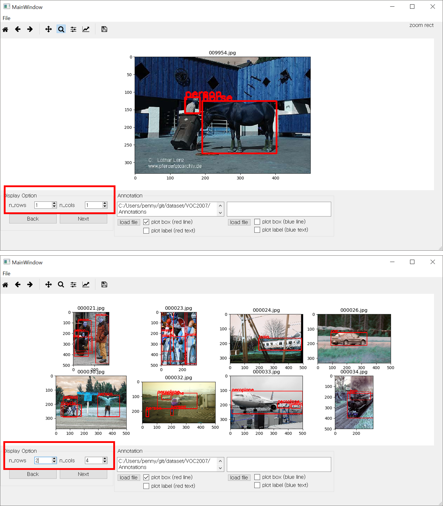

# Pascal-VOC-annotation-viewer

I have implemented a tool to easily plot a [PASCAL Visual Object Classes Dataset (2007)](http://host.robots.ox.ac.uk/pascal/VOC/voc2007/).

## Todo list:
- [x] Plot images with its annotation
- [x] Adjust number of images to plot
- [x] Next & Back button to move page
- [ ] Label & Box thickness option
- [ ] Main window resizing
